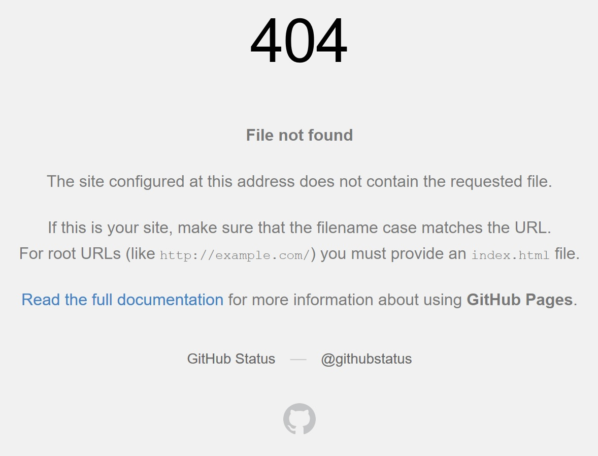

## Kurssin esittely

Command-line Course on Helsingin yliopiston Humanistisen tiedekunnan kurssi,
jossa perehdytään Unixin kaltaisiin käyttöjärjestelmiin ja etenkin niiden
avulla työskentelemiseen komentoriviä käyttäen. Kurssilla on tarkoitus oppia
komentorivin peruskomennot, käyttöjärjestelmän ja kirjastojen rakenne ja hallinta
sekä kirjoittamaan yksinkertaisiin skripteihin perustuvia ohjelmia. Kurssin lopulla
opetellaan käyttämään Git-versionhallintaohjelmistoa ja GitHub-verkkosivustoa
ohjelmavaraston hallinnoimisessa. Opiskelija pääsee jyvälle ohjelmistokehityksen
työnkulun konventioista.

## 1. viikko: Johdatus komentorivin käyttöön

Ensimmäiseksi laitetaan tietokone käyttökuntoon. Windows-koneisiin on asennettava
tarvittavat ohjelmat, esim. Ubuntu, jotta Unix-komentoja voi käyttää ja opetella.

Seuraavaksi perehdytään olennaisiin komentorivillä käytettäviin komentoihin ja
harjoitellaan hakemistoissa navigointia. Myös tiedostomuodot ja tekstieditorit
tulevat tutuiksi.

Opin käyttöjärjestelmien historiasta paljon uutta. Ensiksi oli UNIX, jonka pohjalta
kehitettiin the Berkey Software Distribution eli BSD, johon nykyisetkin macOS-käyttöjärjestelmät
perustuvat. Myöhemmin syntynyt Linux-käyttöjärjestelmien maailma sai alkunsa Linus Torvaldsin
luoman Linux-ytimen ja Richard Stallmanin aloittaman GNU-projektin ohjelmien löytäessä
toisensa.

Taulukossa on muutamia navigointiin tarvittavia komentoja.

| Komento      | Esimerkki        | Toiminto      |
| ------------ | ---------------- | ------------- |
| **ls**       | `$ ls`           | Listaa hakemiston tiedostot |
| **cd**       | `$ cd ..`        | Siirrytään ylempään hakemistoon |
| **cd**       | `$ cd <hakemisto>` | Siirrytään argumenttina annettuun hakemistoon |
| **pwd**    | `$ pwd` | 'Print Working Directory' näyttää nykyisen työhakemiston |

Alla oleva komento luo karhu-nimisen hakemiston. Hakemistoihin voi sijoittaa tiedostoja
ja uusia hakemistoja.
```
$ mkdir karhu
```

## 2. viikko: UNIX-järjestelmä

Opitaan lisää tiedostoista, käyttäjistä, käyttäjien oikeuksista tiedostojen
muokkaajina ja UNIXin tiedostojärjestelmästä. Lisäksi perehdytään ulkoisella
palvelimella työskentelyyn. Lopuksi opitaan tarkastelemaan ja ohjaamaan käyttäjän
käynnistämiä prosesseja.

Opin muuttamaan tiedostojen käyttöoikeuksia ja lukemaan komennon `ls -l` tulostamaa
listaa hakemiston tiedostoista. Nyt tiedän, miten oman koneen ja ulkoisen palvelimen
välillä voi siirtää tiedostoja hyödyntämällä komentoa `scp`.

```
$ chmod 777 esimerkki.txt
```
Komento antaa luku-, kirjoitus- ja suoritusoikeudet esimerkki-tekstitiedostoon
kaikille käyttäjille. Alla listattuna muita annettavia oikeuksia:

* 400
  - Tiedosto on vain omistajan luettavissa
* 002
  - Kaikki voivat muokata tiedostoa
* 010
  - Vain ryhmän jäsenet voivat suorittaa tiedoston

## 3. viikko: Korpusten käsittelyä

Syvennetään komentorivitaitoja ja opetellaan manipuloimaan tekstitiedostoja
tutkimuskäyttöön. Tutuiksi tulevat komennot mm. `sed`, `grep` ja ´tr´ja se, miten
näitä ja muita komentoja voi kirjoittaa yhdeksi ketjuksi.

```
$ echo "hei jamppa!" | sed "s/hei/tsau/"
tsau jamppa!
```
Komentoriville on kirjoitettu kaksi peräkkäistä komentoa, jotka yhdistetään |-merkillä.
Echo-komennon ulostulona olisi "hei jamppa!", mutta se syötetään sed-komennon sisääntulolle.
_Sed_ muuttaa ensimmäisen löytämänsä hei-sanan tsau-sanaksi, minkä tuloksena saamme
"tsau jamppa!".

## 4. viikko: Skriptien kirjoittaminen ja UNIXin ympäristömuuttujat

Kirjoitetaan ensimmäiset skriptit, jotka käsittelevät tutkittavia tekstitiedostoja.
Tutustutaan .bashrc-tiedostoon ja sen tehtäviin Bash-komentotulkin toiminnassa.

## 5. viikko: Ohjelmien tallennus ja käynnistys

Opitaan perusteet ohjelmien tallentamisesta, käynnistämisestä ja kirjastoista.

## 6. viikko: Versionhallinta

Perehdytään käyttämään Git-versionhallintaa ja GitHub-verkkosivuston ohjelmavarastoja.
Tavoitteena on oppia perusteet kehitysprojektien työkulusta.

```
$ git add -A
$ git commit -m "<Infoviesti>"
$ git push origin <branch>
```
Yläpuolella on esitelty tärkeä osa Git-työnkulkua. Komento `add -A` lisää kaikki
oksaan (branch) tehdyt muutokset välitilaan, josta ne on vielä hyväksyttävä komennolla
`commit`. Commit-komennon mukana annetaan lyhyt selostus tehdyistä muutoksista: `$
commit -m "Vaihdoin profiilikuvani."`. Push-komennolla tallennetaan tehdyt muutokset
osaksi ulkoista ohjelmavarastoa (remote repository).

## Verkkosivun rakentaminen GitHub-sivujen avulla

Syvennetään Git-taitoja ja opetellaan kirjoittamaan Markdown-tiedostoja.

On hyvä muistaa, ettei sivujen kehittäminen ole koskaan täysin suoraviivaista puuhaa,
kuten kuva alapuolella kertoo.


