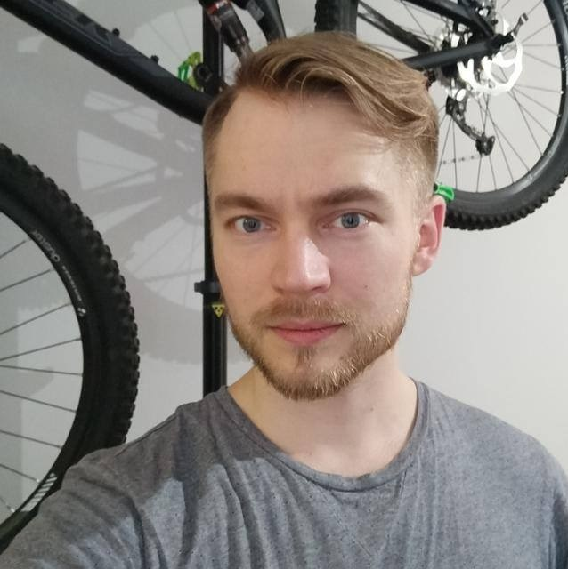

## Esittely

 Olen 29-vuotias suomen kielen opiskelija, jota kiinnostavat luonnollisten kielten lisäksi kieliteknologia ja kognitiotiede. Kognitiotieteen opinnoilla pyrin laajentamaan tietämystäni siitä, miten ihmismieli ja -kieli toimivat yhdessä. Uskon, että tieteellinen ohjelmointi on erittäin tärkeä työkalu vastaavia kysymyksiä ratkottaessa. Siksi kehitän taitojani tietotekniikan ja ohjelmointikielien, mm. Python ja Java, parissa.

Vapaa-ajallani harrastan maantie- ja maastopyöräilyä sekä boulderkiipeilyä. Pyörällä ja julkisilla kulkuneuvoilla taitan myös koulu- ja työmatkoja, mutta talvisin pidän kuntoa yllä sisäpyöräilemällä.

## Löydät minut täältä

[GitHub](https://github.com/vesikko)

## Ole yhteydessä

Sähköpostiosoitteeni on muotoa etunimi.sukunimi@helsinki.fi. 

## Suorittamani kurssit

[Johdatus kognitiotieteeseen](https://wiki.helsinki.fi/display/Kognitiotiede/Cog101+Johdatus+kognitiotieteeseen), syksy 2015

[Language, cognition and the brain](https://wiki.helsinki.fi/display/Kognitiotiede/Cog152+Language%2C+Cognition+and+the+Brain), syksy 2015

[Ohjelmoinnin perusteet](https://courses.helsinki.fi/en/tkt10002/119284736), syksy 2017

[Ohjelmoinnin jatkokurssi](https://courses.helsinki.fi/en/tkt10003/119284733), syksy 2017

[Ohjelmointia lingvisteille](https://courses.helsinki.fi/en/kik-lg208/120338152), kevät 2018

## Projektit

[Cmdline-course](https://github.com/vesikko/cmdline-course): Helsingin yliopiston komentorivikurssin harjoitustehtävä, jossa loin ohjelmavaraston GitHubiin. Projekti sisältää muutaman Python- ja bash-skriptin, joilla muokataan tekstitiedostoja.

## Muita linkkejä

[Solunetti, Suomen virtuaaliyliopisto](http://www.solunetti.fi/fi/)

[Aivojen rakenne ja toiminta, Risto Ilmoniemi](https://www.biomag.hus.fi/braincourse/L1.html)

[Kielipankin korpuspalvelu Korp](https://korp.csc.fi/#?stats_reduce=word&cqp=%5B%5D&corpus=ftb3_europarl,ftb3_jrcacquis,ftb2,reittidemo)

[Kielitoimiston sanakirja](https://www.kielitoimistonsanakirja.fi/)
